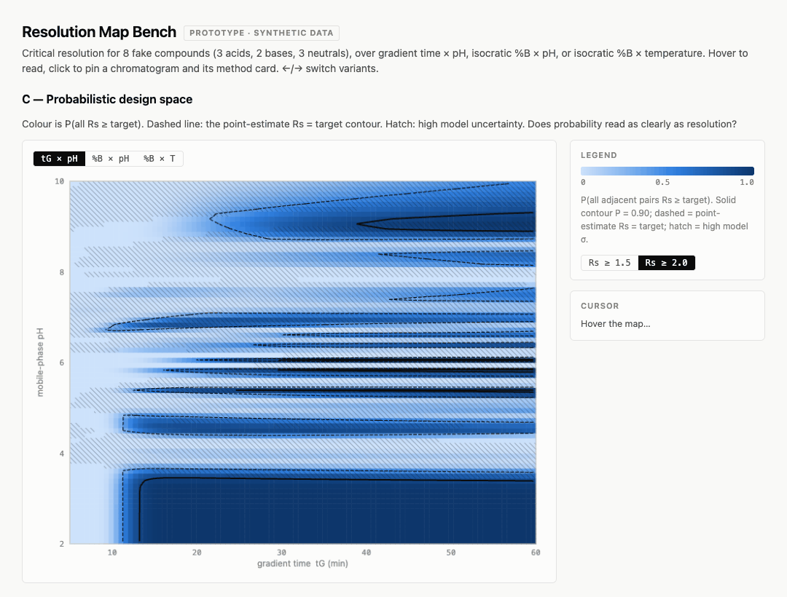

# HPLC retention-order predictor

A research prototype that predicts the elution order of compounds in reversed-phase HPLC
from their structures, and reports how confident it is. For each pair of compounds A and B
at a stated operating point (column, organic modifier, %B, pH), it returns
`P(A before B)`. When a compound is outside what the models cover, it refuses or flags the
prediction instead of guessing.

**Status: research prototype.** No measured retention data has yet been used to calibrate
`P(A before B)`. The pretrained descriptor models are used for inference only; re-fitting
them is planned and has not been done. There is no package or command-line interface. The
code is a set of modules, prototypes and experiments with their written findings.

## The problem

In method development, a chemist chooses a column, a modifier, a gradient and a pH so that
every compound of interest is separated. The hard part is usually not absolute retention
time but **order**: which peaks swap places as pH or %B changes, and which pair is critical
(the adjacent pair with the lowest resolution). A wrong order assumption sends the next
experiment in the wrong direction. Ionisable compounds make this worse, because a small pH
change can move one peak a long way while its neighbours stay put.

A predicted order is useful before any injection only if it comes with an honest
confidence. A tool that says "A elutes before B" with no probability, or with an
overconfident one, cannot tell the chemist which predictions to check first. This project
is built around that confidence: every output is a distribution, and every reported figure
carries its sample size, interval and baseline.

## How it works

```
SMILES
  ├─ applicability check (allowed elements, formal charge)  →  refuse / degrade / pass
  ├─ SoluteML: 25-member chemprop ensemble → Abraham descriptors E, S, A, B
  │   (V, the McGowan volume, is computed from the structure)
  ├─ Uni-pKa microspecies → neutral fraction f_neutral(pH)
  └─ column model
        LSER system constants c, e, s, a, b, v for the column, modifier and %B
        (Wayne State 2019 database, 25 columns, 45 °C)
        HSM column parameters H, S*, A, B, C(2.8), C(7.0) for silanol/ion-exchange
        activity (PQRI database, 819 columns)

log k_neutral = c + eE + sS + aA + bB + vV
k             = k_neutral · (f_neutral + (1 − f_neutral) · 10^(−D))

Scenario ensemble: retention[P, S, n], width[P, S, n], f_neutral[P, S, n]
  P = operating points, S = scenarios, n = compounds
  Each scenario is one complete chromatogram: one draw of the per-run terms shared by
  every compound, plus correlated per-compound draws.

P(A before B) = share of scenarios in which A elutes first
```

`D` is the retention drop for the ionised form. It is split into a per-run part (column and
modifier) and a per-compound part. Peak width comes from a Knox plate-height model
(`model/dispersion.py`), so resolution can be computed as well as order.

Each scenario is stored whole because elution order depends on the correlation between
compounds. Per-compound marginal distributions discard that correlation, so they are only
a display view. The object and its rules are specified in
[`spec/scenario-ensemble.md`](spec/scenario-ensemble.md) and checked by
[`spec/ensemble.py`](spec/ensemble.py).

### Refusal tiers

[`model/applicability.py`](model/applicability.py) assigns every compound one of three
tiers ([`spec/applicability-domain.md`](spec/applicability-domain.md)):

- **in_envelope**: inside the descriptor models' declared domain and the calibration
  compounds' descriptor range.
- **degraded**: predicted, but outside the anchor range (for example, larger than any
  calibration compound). Degraded compounds are scored in their own stratum and never
  pooled with in-envelope ones.
- **refused**: no prediction. Examples are elements outside SoluteML's training set, and
  permanently charged compounds such as quaternary ammonium ions, whose retention runs
  through ion exchange that the LSER model does not describe.

Every reason carries a warrant (`measured`, `declared` or `assumed`), so an assumption
cannot be reported as if it were evidence.

## What has been measured

Each figure below was checked against the file named next to it.

| Result | Value | Source |
|---|---|---|
| Uni-pKa against cited literature pKa | n = 10 values (9 compounds); mean error +0.003, SD 0.170, MAE 0.127, max \|error\| 0.38 (imipramine) | [`model/calibration-results.txt`](model/calibration-results.txt) |
| Refusal tier derived from Uni-pKa output and formal charge, compared with hand labels | 16/16 agree (15 in envelope, 1 quaternary ammonium refused) | [`model/calibration-results.txt`](model/calibration-results.txt) |
| SoluteML ensemble run | all 25 members on all 94 WSU-2019 calibration compounds (2,350 predictions) | [`prototype/descriptor-covariance/soluteml_preds_raw.csv`](prototype/descriptor-covariance/soluteml_preds_raw.csv) |
| SoluteML ensemble mean against measured descriptors (n = 94) | RMSE E 0.154, S 0.186, A 0.080, B 0.063 | [`prototype/descriptor-covariance/FINDINGS.md`](prototype/descriptor-covariance/FINDINGS.md) |
| SoluteML ensemble spread (median within-compound SD) | E 0.039, S 0.050, A 0.021, B 0.029, about 3–4× smaller than the actual error | [`prototype/descriptor-covariance/FINDINGS.md`](prototype/descriptor-covariance/FINDINGS.md) |
| SoluteML signed bias (n = 94, compound-level bootstrap 95% CI) | E +0.035 [+0.004, +0.065], S +0.061 [+0.027, +0.097], A −0.004 [−0.020, +0.011], B +0.018 [+0.006, +0.031] | [`prototype/soluteml-bias/FINDINGS.md`](prototype/soluteml-bias/FINDINGS.md) |
| Sampling the six LSER constants independently instead of jointly | overstates the coefficient-error variance of log k by about 16× (median ratio 0.061, n = 31,208 compound-fit pairs) | [`prototype/descriptor-covariance/FINDINGS.md`](prototype/descriptor-covariance/FINDINGS.md) |
| Thin slice: 16 compounds on XBridge Shield RP18 / acetonitrile, 1,000 scenarios | pairs with P > 0.9: 77, 73 and 70 of 105 at (30%, pH 3.0), (30%, pH 7.0), (50%, pH 5.0) | [`prototype/thin-slice/results.json`](prototype/thin-slice/results.json), [`FINDINGS.md`](prototype/thin-slice/FINDINGS.md) |
| Coverage of RepoRT compounds (18,872 non-SMRT) by SoluteML's training corpus | 9.0% in corpus, 22.0% scaffold seen, 66.9% novel but in envelope, 2.1% out of envelope | [`experiments/solutedb-census/results.txt`](experiments/solutedb-census/results.txt) |

How to read these:

- The SoluteML errors are a **floor**. All 94 calibration compounds are in SoluteML's
  training corpus, so error on new compounds is expected to be larger.
- The thin-slice counts are the model's own confidence. They are **not** accuracy against
  measured retention, which has not been tested yet.
- The 10-value pKa comparison is small, and both Uni-pKa and the literature values are
  aqueous. The correction to the mobile-phase pH scale is not yet modelled.

The calibration method and its acceptance thresholds were written down before any retention
data existed: [`experiments/calibration-preregistration.md`](experiments/calibration-preregistration.md).
Pair-level statistics are counted in compounds, not pairs, because pairs that share a
compound are not independent. The planned laboratory pH sweep is described in
[`experiments/ph-sweep-protocol.md`](experiments/ph-sweep-protocol.md) and has not been run.

## Install and test

The test suite needs Python 3.10 or later and numpy:

```sh
python3 -m venv .venv
.venv/bin/pip install numpy
PYTHON=.venv/bin/python ./run_tests.sh
```

On a fresh clone, 134 checks pass and 9 are skipped. The skipped checks need the WSU-2019
caveat register (`sources/wsu-lser/wsu2019-column-caveats.csv`), which is not
redistributed. Rebuild it as described in
[`sources/wsu-lser/README.md`](sources/wsu-lser/README.md) and all 143 run.

The full prediction pipeline needs two heavier environments, pinned on macOS arm64 with
Python 3.13:

- **Ionisation** (Uni-pKa, RDKit, PyTorch CPU):
  `python3 -m venv env/ionisation-venv && env/ionisation-venv/bin/pip install -r env/requirements.txt`.
  See [`env/README.md`](env/README.md).
- **Descriptors** (SoluteML / chemprop_solvation at a pinned commit, with the patches in
  `env/patches/`): `sh env/install_qspr.sh`. This downloads the 1.9 GB pretrained model
  bundle from Zenodo record 5792296. See [`env/QSPR_ENVIRONMENT.md`](env/QSPR_ENVIRONMENT.md).

`model/columns.py` and most scripts under `prototype/` and `experiments/` also need the
WSU-2019 tables rebuilt locally.

## Prototype view: the resolution map

[`prototype/resolution-map.html`](prototype/resolution-map.html) is a throwaway mock-up of
how a resolution map could show confidence. Open it in a browser; it needs no server. Three
variants (point-estimate Rs, critical-pair territory, and probability) are switched with the
arrow keys or `?variant=A|B|C`.

**The data is synthetic.** The page uses 8 invented compounds and no model from this
repository. Its gradient-time axis is a display experiment; the model itself is isocratic
only (see [Limitations](#limitations)).



## Repository layout

| Path | Contents |
|---|---|
| `model/` | Ionisation provider wiring, sampler, applicability domain, strata, column registry, dispersion, value-of-information study. Findings in `model/README.md`. |
| `spec/` | Interface specifications for the scenario ensemble and the applicability domain, with validators. |
| `prototype/` | Thin vertical slice, SoluteML bias and covariance measurements, evaluation harness, a resolution-map mock-up. Each has a `FINDINGS.md` or `README.md`. |
| `experiments/` | Focused studies (column choice, t0 pH dependence, SoluteDB census, scaffold correlation) and the pre-registration. |
| `data/report/` | Loader and scaffold / unseen-column splits for the RepoRT retention database, pinned to a commit. RepoRT itself is not included. |
| `research/` | Literature and data-source reviews behind the design decisions. |
| `sources/` | Column databases and their provenance. Read the licensing section below. |
| `papers/` | One README per cited paper. The papers themselves are not included. |
| `env/` | Environment lockfiles, install script, patches to upstream SoluteML. |
| `CONTEXT.md` | The project's vocabulary and the decisions that pinned each term. |
| `EXECUTION-PLAN.md` | The phased plan and audit notes. |

The notes refer to design decisions as `#N`. Those numbers are issues in the private
development tracker, which is not public.

## Limitations

- **No retention-order accuracy has been measured.** The calibration plan exists; the data
  does not yet.
- **The ionised-form retention drop `D` is a prior, not a fit.** For ionised compounds it
  accounts for 0.78–0.92 of the predicted variance (`model/README.md`).
- **Column coverage is narrow.** LSER constants exist for the 25 WSU-2019 columns, measured
  at 45 °C. Other columns can be described by their HSM parameters but have no LSER
  constants.
- **Isocratic only.** Gradient compression is not modelled.
- **Descriptor error on new chemistry is unknown.** It has only been measured on compounds
  that SoluteML was trained on.
- **pKa is on the aqueous scale.** The shift to the hydro-organic mobile phase is carried
  as an uncertainty term, not corrected.
- **Neutral, non-ionic training domain.** SoluteML covers the elements H, C, N, O, S, P, F,
  Cl, Br and I only. Compounds outside that set are refused.

## Data and licensing

The code and documentation are released under the [MIT License](LICENSE). Some data in
this repository is not, and some data used during development is not included:

| Data | In this repo | Licence |
|---|---|---|
| PQRI / HSM column database, `sources/hsm-column-db/database.csv` | yes | **CC BY-NC-SA 3.0 US**, not MIT. Non-commercial use only without separate permission. See [`sources/hsm-column-db/README.md`](sources/hsm-column-db/README.md). |
| SoluteDB values in `prototype/soluteml-bias/overlap.csv` | yes | CC BY 4.0 (Chung et al. 2022, Zenodo 5792296) |
| RepoRT compound list in `experiments/solutedb-census/census.csv` | yes | CC BY-SA 4.0 (derived from RepoRT) |
| WSU-2019 LSER tables (Poole, *J. Chromatogr. A* 1600 (2019) 112–126) | **no** | © Elsevier. Rebuild from the supplementary file with `sources/wsu-lser/extract_wsu.py`; see [`sources/wsu-lser/README.md`](sources/wsu-lser/README.md). |
| USP Column Equivalency data | **no** | © USP, no redistribution grant identified. See [`sources/usp-column-db/README.md`](sources/usp-column-db/README.md) for how to obtain it under USP's terms. |
| SoluteML pretrained models | downloaded by `env/install_qspr.sh` | per the upstream Zenodo record |
| Cited papers | no | per publisher; citations in `papers/*/README.md` |

## Main references

- Marchetto et al., *In Silico High-Performance Liquid Chromatography Method Development
  via Machine Learning*, Anal. Chem. 2025, 97, 6991–7001.
  <https://doi.org/10.1021/acs.analchem.4c03466>
- Chung et al., *Group Contribution and Machine Learning Approaches to Predict Abraham
  Solute Parameters, Solvation Free Energy, and Solvation Enthalpy*, J. Chem. Inf. Model.
  2022, 62, 433–446. <https://doi.org/10.1021/acs.jcim.1c01103>
- Poole, *Reversed-phase liquid chromatography system constant database over an extended
  mobile phase composition range for 25 siloxane-bonded silica-based columns*,
  J. Chromatogr. A 1600 (2019) 112–126. <https://doi.org/10.1016/j.chroma.2019.04.027>
- Snyder, Dolan & Carr, J. Chromatogr. A 1060 (2004) 77–116.
  <https://doi.org/10.1016/S0021-9673(04)01480-3>

Full source notes are in [`sources/README.md`](sources/README.md) and `research/`.
